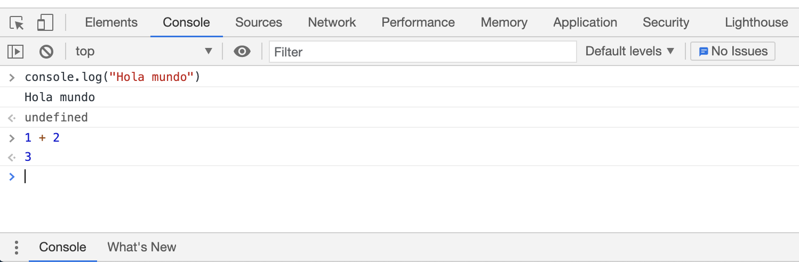
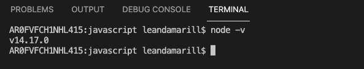
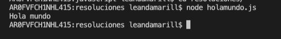
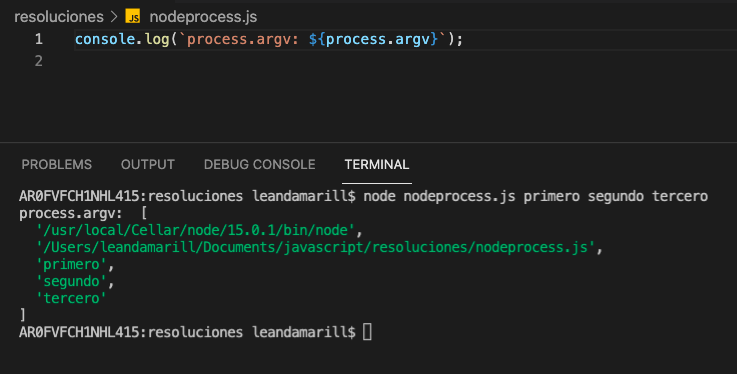
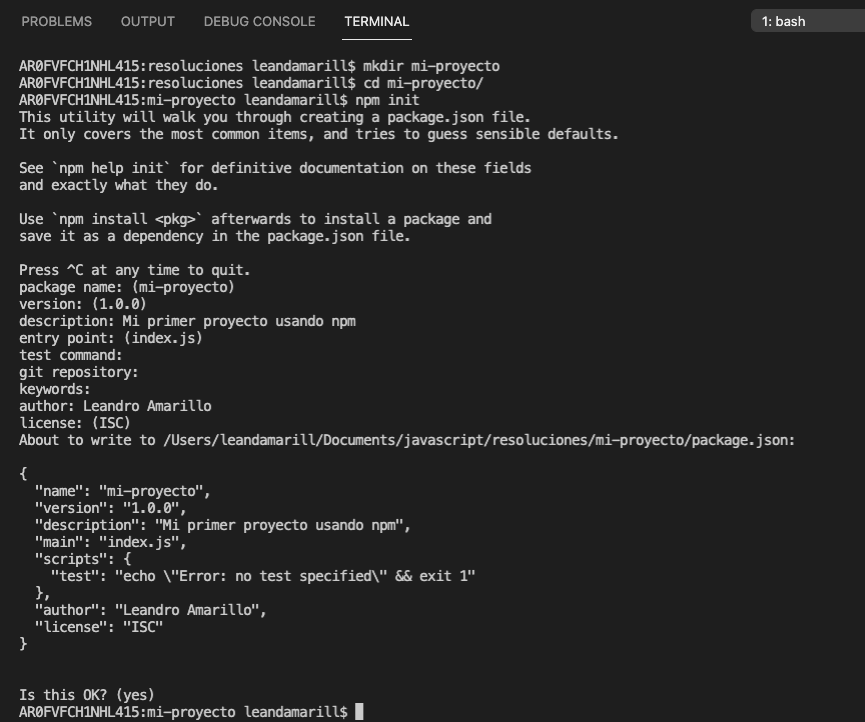

# Javascript

> El siguiente texto es una guia teorica-pracitca sobre javascript escrita para la materia de desarrollo de aplicaciones en la nube de la carrera de ingeniería en sistemas de información - UTN FRSF

## Intro

Javascript es un lenguaje de programación que ejecuta en todos los browsers.

Por ejemplo, en Chrome podemos utilizar las herramientas de desarrolador para abrir una consola presionando Option + ⌘ + J (macOS), o Shift + CTRL + J (Windows/Linux)



Dentro la consola de Chrome ingresamos expresiones de js como nuestro input `>` que luego se ejecutan y su resultado se imprime como output `<` en la terminal misma.

> TIP: La consola de Chrome es util para realizar pruebas mientras estamos aprendiendo ya que nos permite ver resultados inmediatos y sus herramientas de autocompletado e inspeccion son potentes.

Para poder escribir nuestro código y luego poder ejecutarlo vamos a necesitar un poco de ayuda de NodeJS, un entorno de ejecución de javascript, el cual está basado en el motor que utiliza Chrome.

Utilizando Node es que podemos ejecutar javascript en todos lados, incluso en servidores.

Para instalar node basta con dirigirnos a [https://nodejs.org/es/](https://nodejs.org/es/) para descargar e instalar la ultima version `LTS`. Otra alternativa es utilizar `nvm` (node version manager), para cuando necesitamos administrar multiples versiones, el cual se encuentra disponible para [linux/mac](https://github.com/nvm-sh/nvm#install--update-script) y [windows](https://github.com/coreybutler/nvm-windows#installation--upgrades)

Para comprobar si se instalo correctamente abrimos alguna terminal y ejecutamos

```bash
$ node -v
```

Deberiamos ver una respuesta indicando el numero de version de node indicandonos que todo salio bien



Con node instalado solo nos falta un editor de texto, vscode es una buena opción pero tambien existen otros.
Ahora solo nos falta abrir nuestro editor de texto de preferencia y estamos listo para empezar a escribir javascript.

## 0 - Hola mundo

Creando un archivo de extensión `.js` podemos empezar a escribir código, lo que escribamos aquí se ejecutara de arriba hacia abajo hasta finalizar.

Al escribir

```js
console.log("Hola mundo");
```

Suponiendo que nuestro archivo se llama `holamundo.js` podemos abrir una terminal en el mismo directorio que el archivo y ejecutar

```
node holamundo.js
```

Y observamos



### Sintaxis basica de javascript

> Esta sección es un pequeño resumen de sintaxis moderna de javascript (ES6), no es necesario revisar pero la idea es que resulte familiar a lo ya conocido por el alumno o que sirva de punto de partida para explorar

#### Declarando variables

Existen 3 formas de hacerlo

```js
var foo = "asd"; // Variable mutable de scope de funcion o global (No recomendado)
let foo = "asd"; // Variable mutable de scope de bloque
const foo = "asd"; // Variable inmutable de scope de bloque
```

> Para ver la diferencia de porque es recomendable `let` sobre `var` pueden leer este link de [let vs var](https://es.stackoverflow.com/questions/79809/cual-es-la-diferencia-de-usar-let-en-vez-de-var-en-javascript/79813)

En javascript no declaramos el tipo de dato al momento de crear variables, de hecho aunque no es para nada recomendable, el tipo de dato de la variable puede modificarse en tiempo de ejecucion.

El siguiente codigo es javascript valido y nos muestra los tipos de dato mas comunes

```js
let miVariable;
console.log("Type: ", typeof miVariable); // Type: undefined

miVariable = "asd";
console.log("Type: ", typeof miVariable); // Type: string

miVariable = 100;
console.log("Type: ", typeof miVariable); // Type: number

miVariable = 0.212312;
console.log("Type: ", typeof miVariable); // Type: number (no hay distincion de enteros)

miVariable = true;
console.log("Type: ", typeof miVariable); // Type: boolean

// Muchas cosas en javascript son 'object'
miVariable = \[1, 2, 3\]; // Arrays
console.log("Type: ", typeof miVariable); // Type: object

miVariable = {
	id: 1,
	nombre: "juan",
	apellido: "carlos",
	habilitado: true
}; // Objetos
console.log("Type: ", typeof miVariable); // Type: object

miVariable = null; // Null
console.log("Type: ", typeof miVariable); // Type: object

// Tambien podemos declarar variables definidas

let miVariableDefinida = miVariable;
const miConstanteDefinida = miVariable;
```

#### Bloques de control

Javascript tambien soporta los bloques de control similares a los que ya conocemos de otros lenguajes

- [witch](https://developer.mozilla.org/es/docs/Web/JavaScript/Reference/Statements/switch)
- [while](https://developer.mozilla.org/es/docs/Web/JavaScript/Reference/Statements/while)
- [for](https://developer.mozilla.org/es/docs/Web/JavaScript/Reference/Statements/for)
- [if...else](https://developer.mozilla.org/es/docs/Web/JavaScript/Reference/Statements/if...else)

#### Comparando variables

```js
// Operador '==' - Igualdad 'de valor' (no recomendable)
if (100 == "100") {
  console.log("Iguales (?) :thonk:");
}

// Operador '==' - Igualdad de valor y de tipo
if (100 === "100") {
  console.log("Esto no se ejecuta");
}
```

#### Valores Truty & Falsy de variables

Los valores en javascript se consideran verdaderos o falsos dependiendo de su contenido al momento de ser evaluado en un 'contexto booleano', esto es conveniente para checkeos.

| truthy                    | falsy              |
| ------------------------- | ------------------ |
| true                      | false              |
| 'false' (el string false) | 0                  |
| '0' (el string 0)         | '' (string vacio)  |
| () (funcion vacia)        | null               |
| \[\] (array vacio)        | undefined          |
| {} (objeto vacio)         | NaN (Not a number) |
| Los demas valores         |                    |

Algunos ejemplos

```js
let nombre = undefined;

// Usamos !! para negar dos veces e imprimir el valor booleano de la variable
// tambien podriamos haber escrito
//
// if(nombre){
//   console.log("true")
// }
//   console.log("false")
// }

console.log(!!nombre); // false

nombre = null;
console.log(!!nombre); // false

nombre = "";
console.log(!!nombre); // false

nombre = "Ricardo";
console.log(!!nombre); // true
```

#### El objeto global 'process' de Node

Node nos proporciona el objeto global [process](https://es.nodejs.org/docs/latest-v14.x/api/process.html#process_process) para obtener información e interactuar con el proceso actual.

Como `process` es un objeto global solo basta referenciarlo en nuestro programa para poder utilizarlo, sin embargo nuestro editor de texto a veces puede no reconocerlo. Si quisieramos ayudar el autocompletado del editor podríamos escribir:

```
 const process = require('process');
```

Utilizando process recuperar los argumentos de consola accediendo a proces.argv



---

> Ejercicios
> Si querés resolver los ejercicios pensados para esta sección podes dirijirte a la hoja de [ejercicios-00](ejercicios/ejercicios-00.md)

---

## 1 - Funciones y asincronía en javascript

### Definición

Las funciones existen en casi todos los lenguajes de programación modernos, nos permiten encapsular comportamiento y reutilizar codigo. 

```js
function saludador(nombre) {
	return `Hola ${nombre}!`;
}

const greeter = function(name) {
return `Hello ${name}!`;
}

// Invocaciones
saludador("Ricardo");
greeter("Richard");
```

Desde **ES6** también declarar nuestras funciones con la sintaxis de *funciones flecha*

```js
const saludador = (nombre) => {
	return `Hola ${nombre}!`;
}

// Podemos comprimir quitando el return y los {}
const saludador = (nombre) => `Hola ${nombre}!`;

// Si solo recibe un parametro también podemos quitar el () 
const saludador = nombre => `Hola ${nombre}!`;

// Si no recibe parametros tenemos que usar ()
const saludador = () => `Hola Extraño!`;

```

### Funciones como first class citizens

En javascript las funciones van un paso mas alla, se consideran 'first-class citizen' (o ciudadanos de primera clase), esto quiere decir que son tratadas como cualquier otra variable. Por ejemplo, una funcion puede recibir otra funcion como parametros, retornar una funcion y que esta sea luego asignada a una variable.

```js
// Asignando funciones a variables
const f1 = function foo() { console.log("foo"); };
const f2 = function () { console.log("anonima"); };
const f3 = () => console.log("anonima");

// Declarando funciones y ejecutandolas inmediatamente (se asigna el resultado)
const hola = function () { return "hola"} ()
const chau = ( () => "chau" )() // En este caso tenemos que agregar parentesis extras

// Funciones como parametros
const sumar = (a,b) => a + b;
const operar = (operacion, n1, n2) => console.log(operacion(n1,n2))
operar(sumar, 1, 2) // Imprime: 3

// Funciones que retornan funciones (también llamadas thunks)
const restar = (n1) => (n2) => console.log(n1 - n2)
restar(10)(8) // Imprime: 2

```

### Clausuras

Un detalle a mencionar es que javascript, a diferencia de lenguajes como java, no ofrece una manera nativa de marcar funciones 'privadas'. Pero nos permite simular ese comportamiento mediante [clausuras](https://developer.mozilla.org/es/docs/Web/JavaScript/Closures)

Una clausura  es una funcion que permite acceder al ámbito de una función exterior desde una función interior. En JavaScript, las clausuras se crean cada vez que una función es creada.

Veamos este ejemplo

```js
const saludar = (() => {
  const componerNombre = (n, a) => `${n} ${a}`;
  
  return (nombre,apellido) => {
  	const nombreApellido = componerNombre(nombre, apellido);
	console.log(`Hola ${nombreApellido}`)  
  };
})(); 

saludar("Ricardo", "Sanchez");  
```

Estamos definiendo una función y luego ejecutandola inmediatamente, esta retorna otra funcion que toma `nombre` y `apellido` de parametro y se asigna a la variable `saludar`. Ahora, desde la funcion `saludar` estamos haciendo referencia a la funcion interna `componerNombre` pero esta no puede ser accedida de forma externa, logrando un resultado similar al de las funciones privadas.

### Asincronia en Javascript

El runtime de Javascript solo puede ejecutar una sola cosa a la vez, es un lenguaje de programación single-threaded (un hilo) y por lo tanto solo puede procesarse de a una instrucción.

Esto nos impone una limitante al tratar de realizar operaciones que se extienden en el tiempo como consultar apis. Si nuestra función demora estaremos bloqueando el hilo principal y por lo tanto nada mas podra ejecutarse.

Por ejemplo, desde la consola de desarrollador de chrome podemos ejecutar `while(true){}` y de esta manera tildar completamente la tab ya que no desocupamos el hilo para que la página siga funcionando.


Ahora, acabamos de decir que nuestro javascript ejecuta en un unico hilo, por lo que no podemos recurrir a la programación **paralela** para solucionar nuestros problemas pero si a la programación **concurrente**


Pero nosotros no ejecutamos solo javascript, ejecutamos javascript en un navegador o sobre nodejs y estos poseen un modelo de concurrencia basado en un "loop de eventos". Si bien este modelo es diferente al que estamos acostumbrados en lenguajes como Java y existen varios recursos dedicados a [explicar su funcionamiento](https://www.youtube.com/watch?v=8aGhZQkoFbQ) de momento nos alcanza con saber que es la estrategia para resolver tareas concurrentes.

### Modelando la asincronía: Promesas con then/catch

En Javascript, una  `Promise` es un objeto que *PUEDE* producir un valor en algun momento futuro. Se utilizan para representar la terminación o el fracaso de una operación asíncrona. Este objeto admite 3 estados: fulfilled (completada), rejected (rechazada), o pending (sin completar) y expone el metodo `then` que se llama cuando la promesa resuelve  y `catch` cuando se rechaza, ambos métodos reciben callbacks como parametros para manejar los datos o el error recibido.

Dado que la mayoría de las personas consumen `promises` ya creadas, empezaremos primero por cómo consumirlas.

Supongamos que tenemos un método `buscarDatosDeUsuario` que utiliza una api de internet para recurpar los datos de usuario, esta tarea no es instantanea ya que una consulta de red puede demorar varios segundos. Si nuestra funcion devuelve un objeto promise entonces podemos modelarlo de la siguiente manera

```js
buscarDatosDeUsuario()
.then( usuario => console.log(`Hola ${usuario.nombre}!`))
.catch( error => console.log(`No pudimos recuperar los datos. Razon: ${error}`))
```

El metodo `then` aplicado a una funcion devuelve otra promesa, esto nos permite encadenarlas. Siguiendo con nuestro ejemplo, supongamos que luego de recuperar los datos de un usuario tenemos que consultar en otra api las deudas que este posee, usando promesas encadenadas podriamos modelarlo de la siguiente manera

```js
buscarDatosDeUsuario()
.then( usuario => buscarDeudasPendientes(usuario.cuil))
.then( deuda => console.log(deuda.monto == 0 ? "No posee deudas" : `Debe $${deuda.monto}!`))
.catch( error => console.log(`No pudimos recuperar los datos. Razon: ${error}`))
```

En un mundo sin promesas este tipo de operaciones encadenadas tendría que utilizar callbacks, por ejemplo

```js
const falloCallback = error => console.log(`No pudimos recuperar los datos. Razon: ${error}`);

// En cada una pasamos los valores necesarios y
// luego un callback de exito y uno de fallo
buscarDatosDeUsuario( usuario => {
	buscarDeudasPendientes(usuario.cuil, deuda => {
		if(deuda.monto == 0) {
			console.log("No posee deudas");
		} else {
			console.log(`Debe $${deuda.monto}!`);
		}
	},falloCallback);
},falloCallback);
```

Esta estrategía tiene pobre legibilidad y empeora con cada tarea extra, ya que cada callback incrementa el nivel de anidamiento del código, pero cuenta con una ventaja. Debido a que los callbacks son funciones dentro de otras funciones podríamos usar clausuras para acceder a los resultados de las operaciones previas, cosa que utilizando then/catch no seria tan sencillo.

```js
const falloCallback = error => console.log(`No pudimos recuperar los datos. Razon: ${error}`);

// En cada una pasamos los valores necesarios y
// luego un callback de exito y uno de fallo
buscarDatosDeUsuario( usuario => {
	buscarDeudasPendientes(usuario.cuil, deuda => {
		if(deuda.monto == 0) {
			console.log(`No posee deudas. Felicitaciones ${usuario.nombre}`);
		} else {
			console.log(`Debe $${deuda.monto}! Muy mal ${usuario.nombre}`);
		}
	},falloCallback);
},falloCallback);
```

Esto no es mucho una justificación para usarlos ya que desde ES6 existe una estrategía que soluciona este problema y además nos facilita trabajar con promesas en general.

#### Promesas con async await

Como mencionamos anteriormente las promesas son una manera de modelar el codigo asincrono, desde es6 se incluyen las keywords `async` y `await` para poder escribir código asincrono que utiliza promesas como si fuera código síncrono. 

```js
const tarea = async () => {
	try {
		const usuario = await buscarDatosDeUsuario();
		const deuda = await buscarDeudasPendientes(usuario.cuil);
	
		if(deuda.monto == 0){
			console.log(`No posee deudas. Felicitaciones ${usuario.nombre}`);
		} else {
			console.log(`Debe $${deuda.monto}! Muy mal ${usuario.nombre}`);
		}
	} catch (error) {
		console.log(`No pudimos recuperar los datos. Razon: ${error}`);
	}
};
tarea();
```

Si no fuera por las palabras reservadas `async` y `await` pareceria que `buscarDatosDeUsuario` y `buscarDeudasPendientes` son funciones sincronas cuando en realidad entre lineas pueden pasar varios segundos hasta que se ejecuten. Tambien el manejo de errores se movio a un bloque `try/catch` como si fuera un manejo de excepciones.
 
La keyword `await` funciona haciendo que, de alguna manera, la ejecucion del código  'espere' hasta que la promesa se resuelva y luego continua retornando resultado de la promesa. 

Sin entrar mucho en los detalles de como funciona podemos decir que `await`  permite que javascript continue ejecutando otros trabajos mientra la ejecución de nuestro codigo esta suspedido esperando a que se complete la promesa. 

> TIP: No usar el bloque `finally` de un try/catch cuando se utiliza await en promesas. En caso de hacerlo veremos como el bloque finally se ejecutará varias veces, lo cual probablemente no sea el resultado esperado.

Si bien esta sintaxis es mucho mas elegante y sencilla de leer que `.then(...)` tiene una restriccion muy importante de recordar

```
No se puede utilizar await en funciones regulares. Solo en funciones asincronicas.
```

Definir una función como asincronicas es tan sencillo como agregar la keyword `async` delante de nuestra declaración de funcion. Es por esto que en nuestro ejemplo definimos la función `tarea`.

Si estamos utilizando NodeJS a partir de la v14.8 podemos 'saltarnos' esta restricción definiendo nuestros scripts como **módulos**, la forma mas sencilla para archivos individuales es cambiando la extensión de `.js` a `.mjs`

> Importante: Si en tu codigo estabas usando importaciones con la sintaxis 
> ```js
> const cosa = require(cosa)
> ``` 
> Al cambiar la extensión a `.mjs` vas a tener que reemplazarlo por 
> ```js
> import cosa from 'cosa'
> ```

Utilizando el codigo el ejemplo que veniamos siguiendo, nuestro resultado final sería

```js
try {
	const usuario = await buscarDatosDeUsuario();
	const deuda = await buscarDeudasPendientes(usuario.cuil);

	if(deuda.monto == 0){
		console.log(`No posee deudas. Felicitaciones ${usuario.nombre}`);
	} else {
		console.log(`Debe $${deuda.monto}! Muy mal ${usuario.nombre}`);
	}
} catch (error) {
	console.log(`No pudimos recuperar los datos. Razon: ${error}`);
}
```

## 2 - Manipulando objetos y arrays

#### Objetos

Los objetos en javascript son similar a los mapas de otros lenguajes de programacion, no son mas que una collection de propiedades que asocian un nombre ( o clave ) y un valor. El valor de una propiedad puede ser una función, en cuyo caso la propiedad es conocida como un método.

```js
// Creando objeto con keyword new (no se suele utilizar)
const persona1 = new Object

// Creando objeto con notacion de literal
const persona2 = {}

// Agregando propiedades con notacion '.'
persona2.nombre = "Ricardo"

// Agregando propiedades con notacion de map
// Se suele utilizar solo cuando sabemos el nombre de la key durante la ejecución
persona2["nombre"] = "Ricardo"


// Accediendo a los valores de un objeto
console.log(persona2.nombre) // Imprime: "Ricardo"
console.log(persona2["nombre"]) // Imprime: "Ricardo"

// Si tratamos de acceder a los valores de un objeto que no existe
console.log(personaQueNoExiste.nombre) // Imprime: "Uncaught TypeError: Cannot read property 'nombre' of undefined"

//Accediendo a un valores indefinido de un objeto definido
console.log(persona2.apellido) // Imprime: "undefined"

// Usando la notación de literal podemos asignar valores iniciales
const persona = {
	nombre: "Ricardo",
	apellido: "Sanchez",
	cuil: 20388888885,
	intereses: ["programar en javascript", "quejarse de javascript"],
	prepararCafe: async () => {
		// TODO: Solucionar coffee leaks...
	}
}

```


#### Operaciones sobre arrays

Los arrays de javascript proporcionan varios métodos para efectuar operaciones de recorrido y de mutación. Tanto la longitud como el tipo de los elementos de un _array_ son variables.

```js
// Declarando un array
const frutas = ["Manzana", "Ananá", "Banana", "Pera"];

// Podemos tener cualquier tipo de dato dentro de un array
const caos = [ "Hola", { nombre: "Ricardo" }, 123123, false, ["Ananá", "Banana"]];

// Accediendo elementos
console.log(frutas[0]); // Imprime: "Manzana"

// Logitud de un array - propiedad '.length'
console.log(frutas.length); // Imprime: 4

// Iterando sobre elementos de un array
frutas.forEach((elemento, indice, array) => {
    console.log(`Fruta: ${elemento} - Indice: ${indice}`);
});

// Copiar un array
const copiaDeFruta = frutas.slice() 

// Buscar un elemento
const numeros = [5, 12, 8, 130, 44];
numeros.find(n => n > 10) // Retorna: 12 
```

Los arrays de javascript incluyen una api muy potente para operar sobre ellos permitiendo filtrar, ordenar, mapear a otros valores o preguntar sobre los contenidos. Estas operaciones tienen la caracteristica de no modificar el array original, un patrón bastante prevalente en javascript. 

Por ejemplo, en los metodos como `filter` o `map`  que retornan un array, este resultado es nuevo array, el original sigue con todos sus valores intacto. En un principio puede parecer una forma poco performante de operar, desde lo teorico claramente lo es por el overhead extra de crear nuevos objetos, pero desde lo practico es [debatible](https://softwareengineering.stackexchange.com/questions/304574/does-immutability-hurt-performance-in-javascript) el impacto de performance, dificilmente lo notaremos en nuestra apliaciones y los beneficios de eliminar efectos secundarios suelen ser mayores.

##### Map
Devuelve un nuevo array que contiene el resultado de llamar a la función pasada como parámetro a todos los elementos del array sobre el que se invoca.

```js
[1, 2, 3].map(x => x * 2) // Retorna: [2, 4, 6]
```

##### Reduce
Aplica la función pasada como parámetro a un _acumulador_ y a cada valor del _array_, que se recorre de izquierda a derecha, para reducirlo a un único valor.

```js
const miArray = [1, 2, 3, 4];
const reducer = (accumulator, currentValue) => accumulator + currentValue;

miArray.reduce(reducer) // Retorna: 10

// Tambien admite el valor inicial del accumulator como segundo parametro
miArray.reduce(reducer, 1) // Retorna: 11

```

##### Filter
Devuelve un nuevo _array_ que contiene todos los elementos de aquél que cumplan el predicado que se le pasa como parámetro.

```js
const palabras = ["hola", "supercalifragilistico", "oso", "javascript"];

palabras.filter( p => p.length < 4) // Retorna: ["oso"]
```

##### Some
Devuelve `true` si al menos un elemento del _array_ cumple con el predicado que se pasa como parámetro.

```js
const numeros = [1, 2, 3, 4, 5];

const esPar = n => n % 2 === 0;

numeros.some(esPar); // Retorna: true
```
##### Every
Devuelve `true` si todos los elementos del _array_ cumplen el predicado que recibe como parámetro.

```js
const numeros = [1, 2, 3, 4, 5];
const pares = [4, 2, 6, 8, 10];

const esPar = n => n % 2 === 0;

numeros.every(esPar); // Retorna: false 
pares.every(esPar); // Retorna: true 
```

##### Operaciones que modifican el array original

En javascript tratamos de no modificar variables ya que esta suele ser la fuente de muchos errores, por eso se trata de utilizar `const` donde sea posible y transformar los objetos en nuevos en lugar de mutar los existentes. 

Sin embargo Array tambien incluye algunas apis que modifican el array y las comentamos en esta sección.

```js
// Añadir un elemento al final de un Array
frutas.push('Naranja'); // retorna la nueva longitud del array

// Eliminar el ultimo elemento del Array
frutas.pop(); // retorna la nueva longitud del array

// Añadir un elemento al principio de un Array
frutas.unshift('Sandia'); // retorna la nueva longitud del array

// Eliminar el primer elemento de un Array
frutas.shift(); // retorna la nueva longitud del array

// Ordenar un array
const nums = [1, 20, 3];
nums.sort()
console.log(nums) // Imprime: [20, 3, 1]

// Invertir un array
const nombres = ["Juan", "Carlos", "Ruben"];
nombres.reverse();
console.log(nombre) // Imprime: ["Ruben", "Carlos", "Juan"]
```

#### Desestructuración y Spreads

La sintaxis de `desestructuración` y el operador `...` ( spread ) fueron agregada en ES6 para facilitar operar con arrays y objetos. 

La **desestructuracion** es una expresión de JavaScript que permite 'desempacar' valores de arreglos o propiedades de objetos en distintas variables.

La **sintaxis spread** permite a un elemento iterable tal como un arreglo o cadena sea 'expandido' en lugares donde cero o más argumentos (para llamadas de  función) o elementos (para Array literales) son esperados, o a un objeto ser expandido en lugares donde cero o más pares de valores clave (para literales Tipo Objeto) son esperados

La definición es bastante rebuscada y mas que tratar de dar una mas clara es mejor ver la utilidad que traen consigo

##### Operaciones con Arrays

```js
// Asignando a: 10 y b: 20
const numeros = [10, 20];
let [a, b] = numeros;

console.log(a) // Imprime: 10
console.log(b) // Imprime: 20

// Intercambiando los valores de a y b
[a, b] = [b, a]

console.log(a) // Imprime: 20
console.log(b) // Imprime: 10

// Seleccionando los primeros 2 valores de un array usando spread para copiar el resto de valores
const muchosNumeros = [10, 20, 30, 40, 50, 60];
const [primero, segundo, ...resto] = muchosNumeros

console.log(primero) // Imprime: 10
console.log(segundo) // Imprime: 20
console.log(resto) // Imprime: [30, 40, 50, 60]

// Copiando un array
const nuevoArray = [...muchosNumeros]

console.log(nuevoArray) // Imprime: [10, 20, 30, 40, 50, 60]
console.log(muchosNumeros) // Imprime: [10, 20, 30, 40, 50, 60]

nuevoArray.pop() // Removemos el ultimo elemento de la copia

console.log(nuevoArray) // Imprime: [10, 20, 30, 40, 50]
console.log(muchosNumeros) // Imprime: [10, 20, 30, 40, 50, 60]

// Agregando elementos al principio un array
const numeros = [10, 20];
const masNumeros = [1, ...numeros] // Resultado: [1, 10, 20]

// Agregando elementos al final un array
const numeros = [10, 20];
const masNumeros = [...numeros, 1] // Resultado: [10, 20, 1]

// Concatenando arrays
const array1 = [1, 2];
const array2 = [5, 4];
const array3 = [8, 9, 10];

const resultado = [...array1, ...array3, ...array2]; // Resultado: [1, 2, 8, 9, 10, 5, 4]
```

##### Operaciones con Objetos

```js
const persona = {
	nombre: "Ricardo",
	apellido: "Sanchez",
	cuil: 20388888885,
	intereses: ["programar en javascript", "quejarse de javascript"],
};

// Copiando un objeto
const personaCopia = {...persona};

// Extrayendo keys del objeto
const {nombre, intereses} = persona;

console.log(nombre); // Imprime: "Ricardo"
console.log(intereses); // Imprime: ["programar en javascript", "quejarse de javascript"]

// Crear un nuevo objeto modificando keys pero copiando los demas valores
const personaNueva = {...persona, nombre: "Juan"};

console.log(persona.nombre); // Imprime: "Ricardo"
console.log(persona.apellido); // Imprime: "Sanchez"
console.log(personaNueva.nombre); // Imprime: "Juan"
console.log(personaNueva.apellido); // Imprime: "Sanchez"

// Crear un nuevo objeto agregando keys pero copiando los demas valores
const personaNueva = {...persona, copado: true};

console.log(!!personaNueva.copado) // Imprime: true
console.log(!!persona.copado) // Imprime: false
```

## 3 - Mi primer proyecto en NodeJS

Durante esta guia venimos utilizando node para lanzar nuestros scripts de javascript, ahora veremos como escalar esta solución a un proyecto que cuenta con multiples archivos y necesita utilizar librerias de terceros.

#### NPM

Hasta ahora solamente hemos usado las herramientas provistas por NodeJS pero nos estamos perdiendo de una de las ventajas mas grandes de javascript, su extensa comunidad y la gran cantidad de librerias de terceros a nuestra disposición.

Para ayudarnos a encontrar y administrar estas dependencias NodeJS, por defecto, incluye un sistema de gestión de paques llamado NPM (Node Package Manager)

Solo teniendo node instalado, desde una terminal, podemos acceder a el

```bash
$ npm -v
```

Todos nuestros ejercicios implicaban crear un archivo con extensión `.js` y ejecutarlo mediante el comando `node archivo.js`. Si bien puede ser suficiente para scripts sencillos, para desarrollar aplicaciones complejas que necesitan de librerías externas en versiones especificas empezamos a tener problemas.

Utilizando npm podemos generar una estructura de proyecto para nuestra aplicación mediante el comando `npm init`

```bash
$ mkdir mi-proyecto && cd mi-proyecto // Creamos una carpeta y navegamos dentro
$ npm init
```

Al ejecutar el comando `init` la utilizadad de npm nos guiará paso a paso en la creación de un archivo `package.json`.



En el queda descrito el nombre del proyecto, la versión y otras caracteristicas de las cuales, sin duda la mas importante, es el registro de las dependencias necesarias para ejecutar nuestro código.

#### Creando un script de inicializacion de nuestro proyecto
Si revisamos nuestro package.json vemos que se autogenero un tag `main` con el siguiente valor que simboliza el punto de entrada de nuestra aplicacion 

```json
"main": "index.js"
```
> Importante:
> `npm init` no genero ningun archivo index.js asi que vas a tener que generarlo o cambiar el nombre al que tengas

Antes para ejecutar nuestra aplicacion ejecutabamos el comando `node index.js`, al tener `main` definido podemos solo escribir `node .` y dejar que el punto de entrada se levante del `package.json`. Ahora desde npm tambien podemos definir `scripts` de ejecucion.

Para crear script solo hay que asignarle una nombre, seguido del comando de consola a ejecutar, dentro de la key `scripts` del `package.json`. Luego para ejecutarlo desde la terminal lanzamos

```bash
$ npm run nombre-de-script
```

Generalmente en el package json se agrega un script con el nombre `start` que ejecuta nuestra aplicacion, por ejemplo

```json
{
	"name": "mi-proyecto",
	"version": "1.0.0",
	"description": "Mi primer proyecto usando npm",
	"main": "index.js",
	"scripts": {
		"start": "node index.js"
	},
	"author": "Leandro Amarillo",
	"license": "ISC"
}
```

De esta manera ejecutar `npm run start` lanza nuestra apliacion.

Si bien este es un caso bastante trivial, utilizar scripts empieza a volverse muy util para proyectos que cuenten con tests (podriamos crear un script `test` que los ejecute),  cuando queremos modificar argumentos (ejemplo: variables de entorno) o si durante el desarrollo queremos utilizar alguna herramienta como [nodemon](https://www.npmjs.com/package/nodemon) (que veremos mas adelante).

#### Agregando librerias de terceros

Como ya mencionamos, existe una gran cantidad de librerias de terceros listas para ser utilizadas en nuestro código, por ejemplo, podemos ver algunas de ellas en el repositorio [awesome-javascript](https://github.com/sorrycc/awesome-javascrip) que se dedica a recolectar y catalogarlas.

Para agregar una libreria, desde una terminal en el directorio donde se encuentra el `package.json`, debemos ejecutar

```bash
$ npm i nombre-de-libreria
```

Luego de agregar una librería al proyecto el `package.json` habrá agregado una entrada dentro de la key `dependencies`.

Algunas librerias no son necesarias para ejecutar la aplicación pero si para facilitar el desarrollo (ej: framework de testing unitario) y para esto npm tambien nos deja instarlarlas utilizando

```bash
$ npm i nombre-de-libreria -D
```

Estas dependencias tambien se agregan al `package.json` pero dentro de la entrada `devDependencies`

#### El directorio node-modules

Si nos descargamos un proyecto que utiliza npm, por ejemplo desde github, gracias a este `package.json` simplemente tenemos que ejecutar `npm i` para descargar las dependencias requeridas. Estas dependencias se guardan dentro de un directorio llamado `node-modules`, si es la primera vez que se descargan tambien se generá un archivo denominado `package-lock.json` el cual indica las versiones de los paquetes que se descargaron y si este esta versionado permite que todos los que descarguen el proyecto utilicen las mismas versiones de las dependecias.

#### Importando módulos en nuestro código

NodeJS utiliza la sintaxis `require('nombre-del-modulo')` para cargar nuestras dependencias, esta función devuelve un objeto que contiene las funcionalidades que el modulo exporta es por esto que si, por ejemplo, estamos importando el modugo `fs` (file system) incluido en nodejs se suele hacer de la siguiente manera

```js
const fs = require("fs");
```

La misma sintaxis aplica a las librerias de terceros, por ejemplo para utilizar la librería [dayjs](https://github.com/iamkun/dayjs) que nos facilita el manejo de fechas primero ejecutamos `npm i dayjs` para agregar y descargar la dependecia y luego para utilizarla solo hacemos

```js
const dayjs = require("dayjs");
```

##### require (commonJS) vs import (ES6)
 Por default NodeJS utiliza la sintaxis de commonJS, para utilizar la sintaxis de ES6 que utilizaremos cuando veamos react a partir de NodeJS v12 podemos modificar el `package.json` agregando la key `"type": "module"` luego podemos reemplazar nuestros imports a la forma
 
 ```js 
 import dayjs from 'dayjs'
```

 Existen otras diferencias a la hora de generar nuestros propios modulos y detalles de implementacion de como se cargan que no vienen al caso en una guia introductoria. A partir de este momento se utilizara la sintaxis de ES6 para mantener la familiaridad para cuando veamos react a futuro.

## 4 - API usando NodeJS y Express

#### Express

#### Reiniciando nuestro servidor local cuando se modifican archivos

//TODO
