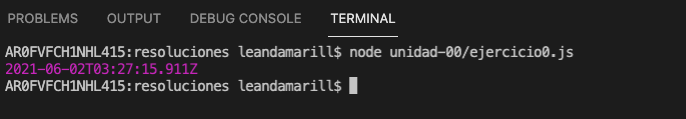

## Ejercicios - Hola mundo

> Esta guía esta desarrollada en base a los conceptos presentados en la seccion ['0 - Hola mundo'](../README#0-hola-mundo)

#### 0 - Disculpe, tiene hora?

Escribir un programa que imprima por consola la hora actual (no importa el formato de la fecha). Utilizar el objeto `Date` de javascript. Podes ayudarte con la documentación de mozilla en [https://developer.mozilla.org/es/docs/Web/JavaScript/Reference/Global_Objects/Date](https://developer.mozilla.org/es/docs/Web/JavaScript/Reference/Global_Objects/Date)

##### Ejemplo



---

#### 1 - Hola ${Dev}

Escribir un programa que reciba como argumento un nombre e imprima por consola un saludo diciendo `Hola {nombre}` donde `{nombre}` es el argumento recibido.

> TIP: En lugar de concatenar cadenas usando '+' la sintaxis de ES6 nos permite interpolar strings de la siguiente forma
>
> ```js
> const nombre = "Ricardo";
> const apellido = "Fuentes";
> // Prestar atención a los backticks [ `` ]
> console.log(`Hola ${nombre} ${apellido}!`);
> console.log("Hola " + nombre + " " + apellido + "!");
> ```
>
> Ambas imprimen "Hola Ricardo Fuentes!" como resultado

##### Ejemplo


---

#### 2 - F de Fahrenheit

Escribir un programa que reciba como argumento un número que represente un valor de temperatura en grados Celsius, validar que la entrada exista y sea numérica. Si la entrada es invalida imprimir un mensaje de error. Si la entrada es valida convertirla a grados Fahrenheit e imprimir `{temperatura en celsius}°C son {temperatura en fahrenheit}°F`

Formula de conversión:

```
C/5 = (F-32)/9

C: temperatura en celsius
F: temperatura en ahrenheit
```

> TIP: Prestar atención al tipo de dato de los parametros ingresados.

<!-- ##### Resultado

//Completar -->

---

#### 3 - Herón Herón que grande sos

Escribir un programa que reciba como argumento los 3 lados de un triangulo (validando la entrada) y calcule su area utilizando para luego imprimirla como resultado.

Las reglas para validar la entrada son las siguientes:

- Deben recibirse 3 números como argumento, si alguno falta o no es un número se mostrara el mensaje 'Ingrese 3 números como parametros'
- Dado 3 números A, B y C un triangulo es válido si la suma de cualquiera de dos de sus lados es mayor al tercero. Es decir, si `A + B > C`, `B + C > A` y `C + A > B`. Si los argumentos no conforman un triangulo valido se imprimirá el mensaje 'Ingrese la logitud de los 3 lados de un triángulo valido como parametros'

Con nuestros 3 lados procederemos calcular el área del triangulo de la siguiente manera


Para el calculo de las raices cuadradas podemos utilizar en el objeto `Math` que nos proporciona una funcion `sqrt(number)` para utilizar. Podés ayudarte con la documentación de la misma en [https://developer.mozilla.org/es/docs/Web/JavaScript/Reference/Global_Objects/Math](https://developer.mozilla.org/es/docs/Web/JavaScript/Reference/Global_Objects/Math)

<!-- ##### Resultado

// Completar -->

---

#### 4 - Primer lunes, peor lunes

Escribir un programa que reciba como parametro un año y devuelva como resultado el peor lunes de ese año (el primero del año).

Validar que si haya ingresado un año y que este se encuentre en el rango entre 271821 B.C y 275760 (los valores permitidos segun el estandar). En caso contrario imprimir el mensaje 'Ingrese una fecha válida'

Podes saber en que día de la semana utilizando [miFecha.getDay()](https://developer.mozilla.org/es/docs/Web/JavaScript/Reference/Global_Objects/Date/getDay)

Ademas, los `Date` cuentan con un metodo `setFullYear` que puede resultarte util, tambien podés ayudarte con la documentación de mozilla en [https://developer.mozilla.org/es/docs/Web/JavaScript/Reference/Global_Objects/Date](https://developer.mozilla.org/es/docs/Web/JavaScript/Reference/Global_Objects/Date)

<!-- ##### Resultado

// Completar -->

---

#### 5 - Llamó Google, tenés entrevista y te pidieron un FizzBuzz

Escribi un programa que reciba como argumento un número X mayor que 1. El programa deberá imprimir en pantalla los numeros del 1 a X, sustituyendo los múltiplos de 3 por la palabra `Fizz`, los múltiplos de 5 por la palabra `Buzz` y los múltiplos de 3 y 5 por la palabra `Soy muy original`.
